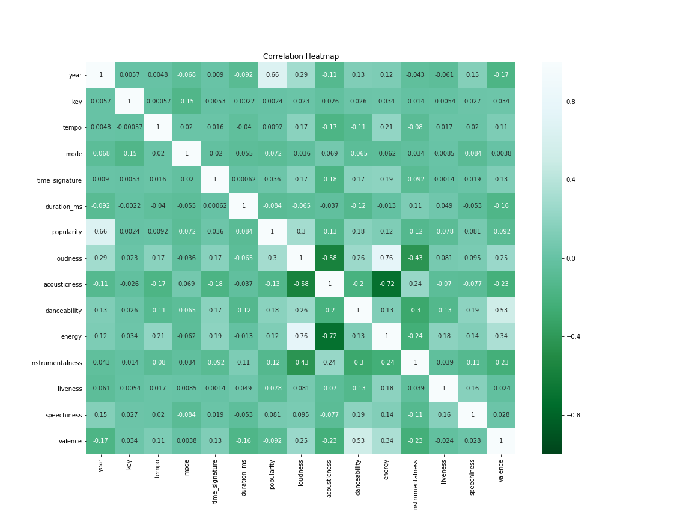
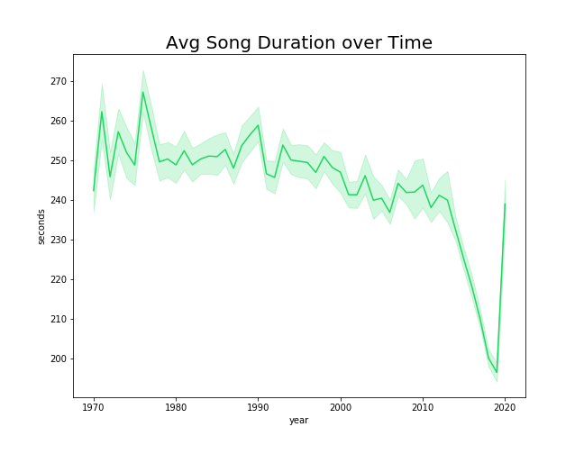
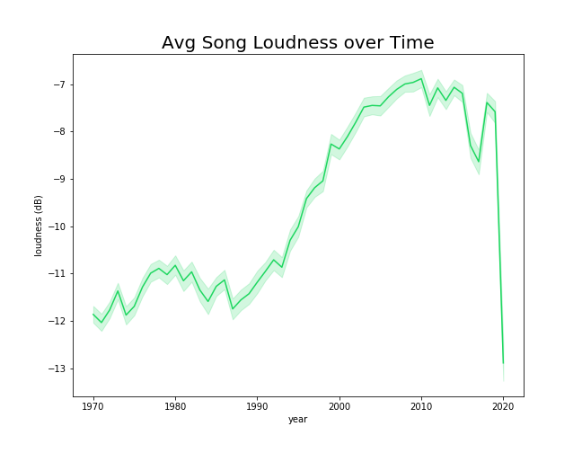
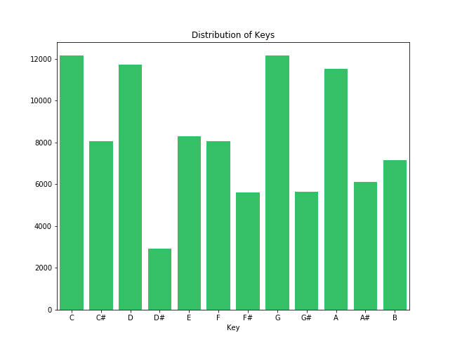
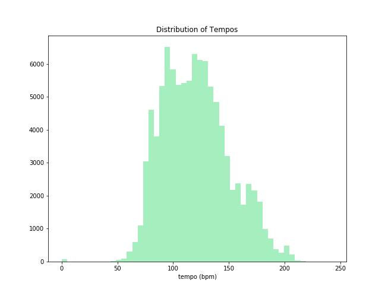
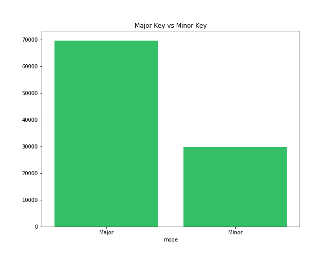
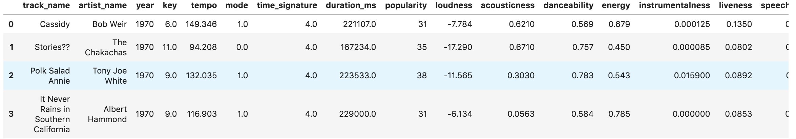
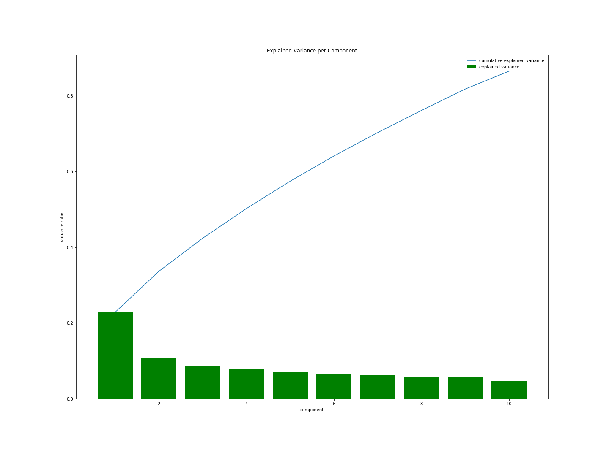
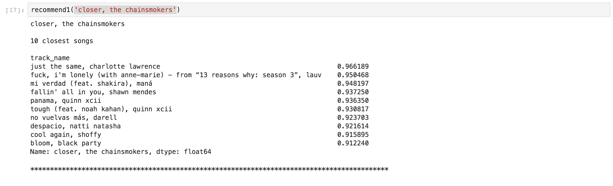
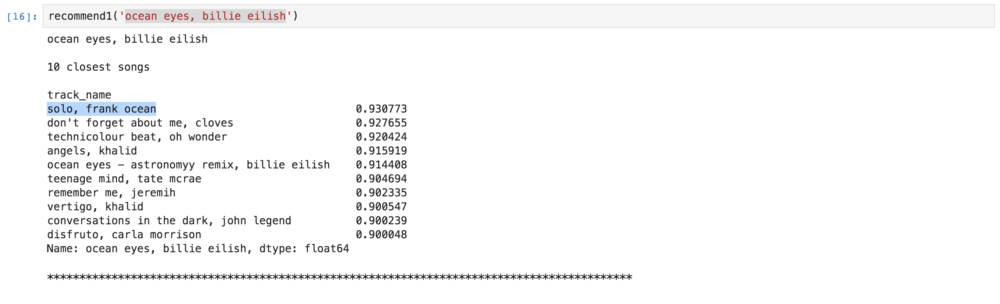

# Song Recommender with Spotify Data
*Author: Brendan Lo*
___
## Problem Statement
Music is a big part of my life, and a big part of many others' lives.  

You can see this with Spotify's 258 million active users and 113 million subscribers, not including other music streaming platforms in the market. While streaming has made consumption of music more accessible, these services have also streamlined easier processes for musicians and artists to distribute their content via these popular platforms. Low barriers to entry for musicians/artists saturates the music industry and it drowns out alot of great music. It is said that about 1 million new tracks are released on Spotify per year, yet most people's playlists proably consist of a total less than 500 tracks. You could spend the rest of your life listening to new music and you wouldn't be able to finish close to all of it!

This project seeks to drive music exploration and discovery with a product-based recommender system, similar to Spotify's *Discover* function. The goal is to guide users in the right direction with new music to listen to, based on songs they are already interested in.

___
## Contents:
- [Data Dictionary](#Data-Dictionary)
- [Exploratory Data Analysis](#Exploratory-Data-Analysis)
- [Preprocessing](#Preprocessing)
- [Recommender Summary](#Recommender-Summary)
- [Limitations](#Limitations)
- [Next Steps](#Next-Steps)
  
      
 
   

___

## Data Dictionary:
The data scraped for this project was from Spotify's internal data labeled "Track Features". 2,000 tracks were scraped from each year between the years 1970 and 2020, totaling 100,000 tracks. In addition to basic metrics for music such as tempo, key, they also labeled each song with various other metrics based on internal algorithms. The definitions of these metrics are listed below.  

|Feature|Type|Description|
|---|---|---|
|year|float|The year in which the song was officially released.|
|key|float|The key the track is in. Integers map to pitches using standard [Pitch Class Notation](https://en.wikipedia.org/wiki/Pitch_class) . E.g. 0 = C, 1 = C♯/D♭, 2 = D, and so on.|
|tempo|float|The overall estimated tempo of a track in beats per minute (BPM). In musical terminology, tempo is the speed or pace of a given piece and derives directly from the average beat duration.|
|mode|int|Mode indicates the modality (major or minor) of a track, the type of scale from which its melodic content is derived. Major is represented by 1 and minor is 0.|
|time_signature|int|An estimated overall time signature of a track. The time signature (meter) is a notational convention to specify how many beats are in each bar (or measure).|
|duration_ms|int|Duration of song in milliseconds.|
|popularity|int|The popularity of the track. The value will be between 0 and 100, with 100 being the most popular.The popularity of a track is a value between 0 and 100, with 100 being the most popular.|
|loudness|float|The overall loudness of a track in decibels (dB). Loudness values are averaged across the entire track and are useful for comparing relative loudness of tracks. Loudness is the quality of a sound that is the primary psychological correlate of physical strength (amplitude). Values typical range between -60 and 0 db.|
|acousticness|float|A confidence measure from 0.0 to 1.0 of whether the track is acoustic. 1.0 represents high confidence the track is acoustic.|
|danceability|float|Danceability describes how suitable a track is for dancing based on a combination of musical elements including tempo, rhythm stability, beat strength, and overall regularity. A value of 0.0 is least danceable and 1.0 is most danceable.|
|energy|float|Energy is a measure from 0.0 to 1.0 and represents a perceptual measure of intensity and activity. Typically, energetic tracks feel fast, loud, and noisy. For example, death metal has high energy, while a Bach prelude scores low on the scale. Perceptual features contributing to this attribute include dynamic range, perceived loudness, timbre, onset rate, and general entropy.|
|instrumentalness|float|Predicts whether a track contains no vocals. “Ooh” and “aah” sounds are treated as instrumental in this context. Rap or spoken word tracks are clearly “vocal”. The closer the instrumentalness value is to 1.0, the greater likelihood the track contains no vocal content. Values above 0.5 are intended to represent instrumental tracks, but confidence is higher as the value approaches 1.0.|
|liveness|float|Detects the presence of an audience in the recording. Higher liveness values represent an increased probability that the track was performed live. A value above 0.8 provides strong likelihood that the track is live.|
|speechiness|float|Speechiness detects the presence of spoken words in a track. The more exclusively speech-like the recording (e.g. talk show, audio book, poetry), the closer to 1.0 the attribute value. Values above 0.66 describe tracks that are probably made entirely of spoken words. Values between 0.33 and 0.66 describe tracks that may contain both music and speech, either in sections or layered, including such cases as rap music. Values below 0.33 most likely represent music and other non-speech-like tracks.|
|valence|float|A measure from 0.0 to 1.0 describing the musical positiveness conveyed by a track. Tracks with high valence sound more positive (e.g. happy, cheerful, euphoric), while tracks with low valence sound more negative (e.g. sad, depressed, angry).|
|uri|Object|Spotify's unique identfier for the track. Entering this id into Spotify's search will bring you directly to that specific track.|

  

Descriptions were taken from the official documentation at Spotify's Developer website [here](https://developer.spotify.com/documentation/web-api/reference/tracks/get-several-audio-features/). They also show the distribution of many of these metrics if you are interested.
___
## Exploratory Data Analysis

**Data Cleaning**  
Minimal Data Cleaning was done prior to EDA. Spotify's data barely had any null values or faulty values. The biggest cleaning of the data was removing duplicated songs. About 2,000 of the 100,000 were duplicated songs. Those duplicates were removed, resulting in about 98,000 tracks to work with in our dataset.

  

Below are some interesting visualizations I thought were worth exploring:

 
 
 
  

**Analysis:**  
- The heatmap was a good way to overview any relationships among all the variables available to us. The only relatively strong relationships were the negative correlations between acousticness vs. energy and acousticness vs. loudness. 

- The paradigm of music becoming louder overtime, as seen by the graph of loudness overtime can be attributed to more electronic elements becoming incorporated into the music industry which are generally louder than their acoustic counterparts. The rise in loudness overtime can also be attributed to "louder sounding better" to the average listener.

- It was also interesting to look at song duration getting significatly shorter in the last 10 years. This shows the music industry adapting their work based on the "shorter attention spans" of consumers that grows along with technological advances that prioritize accessibility and getting services ASAP.
    - *note*: 2020's data is highly unreliable since this data was scraped 3 months into the year of 2020, which is not comparable to full-year's worth of data for all the other years.  
    

- You can see that a majority of music lies within 90 to 120 bpm. Fun fact: the default bpm when you open up a Digital Audio Work Station is 120 bpm!

- There is a significantly higher amount of songs written in a major key vs. minor key. While not always the case, major keys are more associated with happier tunes.
___
## Preprocessing

**Due to Computer memory limitations, I will only use songs between the years 2000 to 2020, bringing our dataset down to about 40,000 songs.**  

This decision was made because the work done below is beyond the memory capacity of my computer. Bringing the process onto the cloud was an option, but pulling the data back into my computer was still a problem.  

### Standard Scaling
Since all our features were all on widely different scales, we scaled all features to be in standard deviations from the mean so they are more comparable.
### Cosine Similarity
- For our product-based recommender (using features we know about our "product", the songs in this case), we will use cosine similarity for our recommender model.

- Citing [Wikipedia](https://en.wikipedia.org/wiki/Cosine_similarity#:~:text=):

    *Cosine similarity is a measure of similarity between two non-zero vectors of an inner product space that measures the cosine of the angle between them. The cosine of 0° is 1, and it is less than 1 for any angle in the interval (0, π] radians. It is thus a judgment of orientation and not magnitude: two vectors with the same orientation have a cosine similarity of 1, two vectors oriented at 90° relative to each other have a similarity of 0, and two vectors diametrically opposed have a similarity of -1, independent of their magnitude.*
    
    
    
- In our case, each track is its own vector of unique features. We will get a big matrix comparing each song to every other song in our dataset.

  

  

### Singular Value Decomposition(SVD)

- SVD is dimensionality reduction technique related to Principle Component Analysis (PCA). SVD takes any shaped matrix M and factorizes it into the product of 3 separate matrixes. This simplifies the maxtrix to include only features important to aproximate the original matrix.
>what is the difference between SVD and PCA? I think Jonathan from this [medium article](https://medium.com/@jonathan_hui/machine-learning-singular-value-decomposition-svd-principal-component-analysis-pca-1d45e885e491#:~:text=) said it well: "*SVD gives you the whole nine-yard of diagonalizing a matrix into special matrices that are easy to manipulate and to analyze. It lay down the foundation to untangle data into independent components. PCA skips less significant components. Obviously, we can use SVD to find PCA by truncating the less important basis vectors in the original SVD matrix.*"

That article dives deeper into the Linear Algebra that is behind SVD and PCA, if you are interested in a quick read.

- SVD can thus be used as a data compression technique. This is relevant since our current dataset takes a large amount of physical memory.
- Reducing to only 10 components explained greater than 90% variance in our data.

## Recommender Summary

Let's take a look at some results we get from the recommender:

 

**Observations:** 
- "Closer" by the Chainsmokers is a very popular song that lies somewhere between the EDM and Pop genres. 
- Our top 3 recommendations were "Just the Same" by Charlotte Lawrence, "F, I'm Lonely" by Lauv, "Mi Verdad" by Shakira. 
- The first observation before listening to any of these songs is that our recommender is able to recommend songs of other languages.
- Our top 2 songs have very strong pop influence, but instrumentation is very different from our input.
- Our 3rd recommendation is Latin pop and the instrumentation is a lot more acoustic in comparison to our input.

**Observations:** 
- "Ocean Eyes" is Billie Eilish's debut single featuring wonderful pop vocals and instrumentation.
- Our top recommended song sounds very different from our input. Frank Ocean is a popular artist in the RnB space.
- "Don't Forget About Me" by Clovers was a new song to me. It actually sounded very musically similar to Ocean Eyes.
- "Technicolor Beat" by Oh Wonder also had  pop influenced vocals but had a lot more synthetic sounds involved in the soundscape.

  
  

### Key Takeaways: 
- Our recommender is based on "audio features", which returns music with similar features musically.
- Often genres are defined by the specific sound design and timbres of its instrumentation. Our recommender was often returning songs that could be in a complete different genre, sounding completey different yet being very similar musically.
- Since this recommender recommends songs based on audio features (genre was not a feature), it is a great away to discover music that is out of your usual comfort zone.\

___
## Limitations
- As mentioned before, memory was a limitation in this project. Creating a cosine similarity of matrix  of 100,000 by 100,000 songs in 15 dimensions(15 features) is computationally very heavy. Ideally I would have a lot more computing power and memory to work with.
- Only 2,000 songs were scraped from each year due to scraping limits created by Spotify. Ideally we would want to scrape a lot more songs per year, especially knowing that up to a million songs are released per year. Having a complete database can lead to more complete recommendations.
- unfortunately it is not clear what the 2,000 tracks searched queried per year are sorted by. There are quite a few very popular songs that are not present in the scraped dataset.

___
## Next Steps

- Creating this recommender into a usable app would be the next biggest step for accessability.
- Researching ways to improve efficiency in our code. Currently running my recommender code takes a significant amount of memory, even after taking measures to make it easier on my computer already.
- Understanding my data beter - contacting Spotify to understand how the 2,000 tracks queried per year are sorted by.
- Potentially scrape genre information for songs, to create a more traditional recommender of songs that sound more similar rather than just taking into account music features.
- Collect user feedback on the recommender system performance. The best recommenders are a likely a mix of product and collaboration based, where both features of the product and reviews on recommender performance are taken into account for our recommender model.
